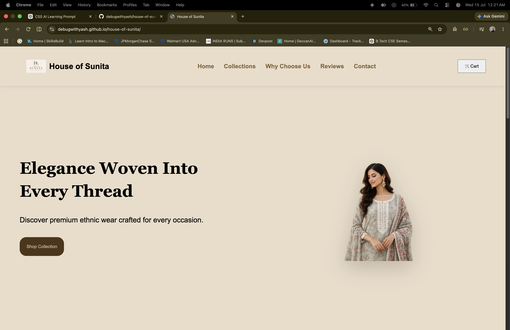

# 🌸 House of Sunita

A premium and responsive ethnic fashion landing page built using **HTML5** and **CSS3**. This project showcases a modern fashion website with a clean UI, responsive layout, and elegant design.

## 🌐 Live Demo

👉 https://debugwithyash.github.io/house-of-sunita/

## 📸 Preview

> Add a screenshot of your homepage here.

Example:



---

## ✨ Features

- 🏠 Responsive Navigation Bar
- 🌸 Hero Section
- 🛍️ Featured Collections
- 💎 Why Choose Us Section
- ⭐ Customer Reviews
- 📱 Responsive Design
- 🎨 Modern UI
- 🖱️ Hover Effects
- 📌 Sticky Navigation
- 🔗 Smooth Scrolling

---

## 🛠️ Built With

- HTML5
- CSS3
- Flexbox
- CSS Grid

---

## 📂 Folder Structure

```text
house-of-sunita/
│
├── images/
├── index.html
├── style.css
└── README.md
```

---

## 🚀 Getting Started

1. Clone the repository

```bash
git clone https://github.com/debugwithyash/house-of-sunita.git
```

2. Open the project folder.

3. Open `index.html` in your browser.

---

## 📚 What I Learned

- Semantic HTML
- CSS Flexbox
- CSS Grid
- Responsive Web Design
- Hover Effects
- Sticky Navigation
- CSS Transitions

---

## 🎯 Future Improvements

- JavaScript Shopping Cart
- Product Search
- Dark Mode
- Animations
- Product Filters
- Wishlist
- React Version

---

## 👨‍💻 Author

**Yash Chaudhary**

- GitHub: https://github.com/debugwithyash
- Live Demo: https://debugwithyash.github.io/house-of-sunita/

---

⭐ If you like this project, consider giving it a **Star** on GitHub!
